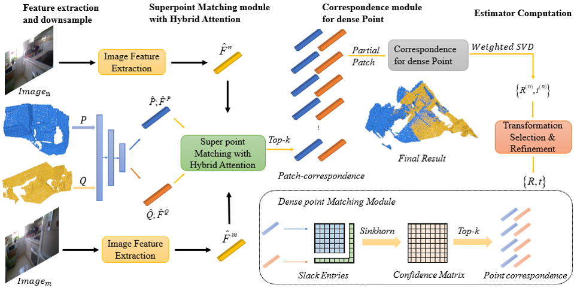
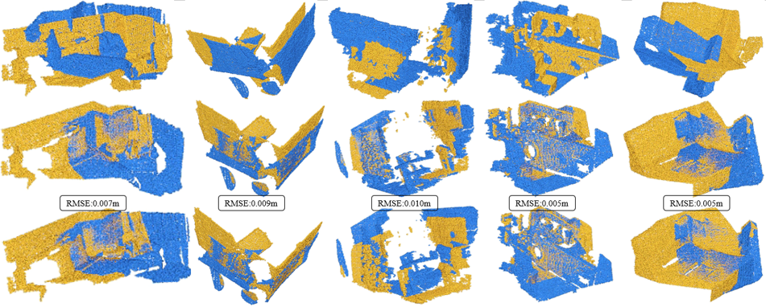

# CMHANet
It is a new method of point cloud registration with mm.

Code has been tested with Ubuntu 20.04, GCC 9.4.0, Python 3.7, PyTorch 1.9.0, CUDA 11.2 and PyTorch3D 0.6.2.

## Environment Setup
You can set up the environment following Geo&IGReg.

## DataSet
The dataset can be downloaded from [PREDATOR](https://github.com/prs-eth/OverlapPredator) (by running the following commands):
```bash
wget --no-check-certificate --show-progress https://share.phys.ethz.ch/~gsg/pairwise_reg/3dmatch.zip
unzip 3dmatch.zip
```
```text
--data--3DMatch--metadata
              |--data--train--7-scenes-chess--camera-intrinsics.txt
                    |      |               |--cloud_bin_0_0_pose.txt
                    |      |               |--cloud_bin_0_0.png
                    |      |               |--cloud_bin_0.info.txt
                    |      |               |--cloud_bin_0.pth
                    |      |               |--...
                    |      |--...
                    |--test--7-scenes-redkitchen--camera-intrinsics.txt
                          |                    |--cloud_bin_0_0_pose.txt
                          |                    |--cloud_bin_0_0.png
                          |                    |--cloud_bin_0.info.txt
                          |                    |--cloud_bin_0.pth
                          |                    |--...
                          |--...
```

## Training
The code for 3D(Lo)Match is in `experiments/3dmatch`.

## Testing
Use test.py or eval.py to test 3DMatch dataset. We have provideed the detailed log information in output.txt and results_detailed.txt.
We also provide pretrained weights in `weight` directory in the future.
You can repalce `3DMatch` with `3DLoMatch` to evaluate on 3DLoMatch.

### Qualitative results
The results are as follows:
